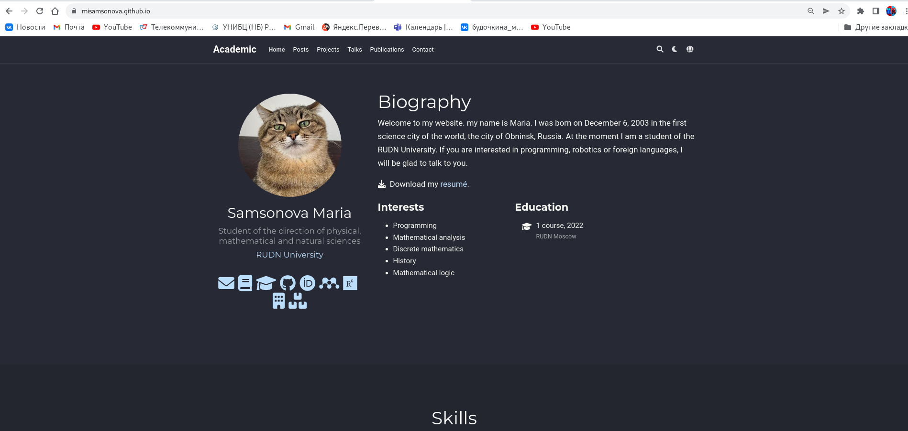

---
## Front matter
title: "Отчёт по 6 этапу реализации проекта"
subtitle: "Операционные системы"
author: "Самсонова Мария Ильинична"
## Generic otions
lang: ru-RU
toc-title: "Содержание"

## Bibliography
bibliography: bib/cite.bib
csl: pandoc/csl/gost-r-7-0-5-2008-numeric.csl

## Pdf output format
toc: true # Table of contents
toc-depth: 2
lof: true # List of figures
lot: true # List of tables
fontsize: 12pt
linestretch: 1.5
papersize: a4
documentclass: scrreprt
## I18n polyglossia
polyglossia-lang:
  name: russian
  options:
  - spelling=modern
  - babelshorthands=true
polyglossia-otherlangs:
  name: english
## I18n babel
babel-lang: russian
babel-otherlangs: english
## Fonts
mainfont: PT Serif
romanfont: PT Serif
sansfont: PT Sans
monofont: PT Mono
mainfontoptions: Ligatures=TeX
romanfontoptions: Ligatures=TeX
sansfontoptions: Ligatures=TeX,Scale=MatchLowercase
monofontoptions: Scale=MatchLowercase,Scale=0.9
## Biblatex
biblatex: true
biblio-style: "gost-numeric"
biblatexoptions:
  - parentracker=true
  - backend=biber
  - hyperref=auto
  - language=auto
  - autolang=other*
  - citestyle=gost-numeric
## Pandoc-crossref LaTeX customization
figureTitle: "Рис."
tableTitle: "Таблица"
listingTitle: "Листинг"
lofTitle: "Список иллюстраций"
lotTitle: "Список таблиц"
lolTitle: "Листинги"
## Misc options
indent: true
header-includes:
  - \usepackage{indentfirst}
  - \usepackage{float} # keep figures where there are in the text
  - \floatplacement{figure}{H} # keep figures where there are in the text
---
# Цель работы

Приобретение практических навыков оформление сайта на двух языках, размещения информации на двух языках о себе и выкладывания постов на собственном сайте путем редактирования файлов в каталогах, создания новых файлов и каталогов и обновления через Терминал файлов.

# Задание

Размещение двуязычного сайта на Github:

- Сделать поддержку английского и русского языков.
- Разместить элементы сайта на обоих языках.
- Разместить контент на обоих языках.
- Сделать пост по прошедшей неделе.
- Добавить пост на тему по выбору (на двух языках).

# Реализация 6-его этапа индивидуального проекта

1. Для начала запустим наш сайт: (рис. -@fig:001)

{ #fig:001 width=70% }

2. Создаём нужные каталоги и файлы: (рис. -@fig:002, -@fig:003, -@fig:004, -@fig:005, -@fig:006, -@fig:007)

{ #fig:002 width=70% }

{ #fig:003 width=70% }

{ #fig:004 width=70% }

{ #fig:005 width=70% }

{ #fig:006 width=70% }

{ #fig:007 width=70% }

3. Теперь переходим в каталог  *~/blog/config/_default*, редактируем файл *languages.yaml*, где добавляем блок для поддержки русского языка на нашем сайте.  (рис. -@fig:008)

{ #fig:008 width=70% }

4. Далее переходим в каталог  *~/blog/i18n*, редактируем файл *ru.yaml*, где добавляем код, который отвечает за названия (загаловки разделов/строк) на сайте.  (рис. -@fig:009)

{ #fig:009 width=70% }

5. После этого переходим в каталог  *~/blog/content/ru/Home*, редактируем все файлы, то есть внутри них загаловки разделов на сайте. (рис.-@fig:010, -@fig:011, -@fig:012)

{ #fig:010 width=70% }

{ #fig:011 width=70% }

{ #fig:012 width=70% }

- Теперь переходим в каталог  *~/blog/content/ru/Authors/admin*, редактируем файл *_index.md*, переводя биографию на русский язык. (рис. -@fig:013)

{ #fig:013 width=70% }

- Далее переходим в каталоги  *~/blog/content/ru/post*, *~/blog/content/en/post*, *~/blog/content/en/project/example*, редактируем все файлы постов и проекта, переводя их на русский и английские языки. (рис. -@fig:014,-@fig:015,-@fig:016,-@fig:017)

{ #fig:014 width=70% }

{ #fig:015 width=70% }

{ #fig:016 width=70% }

{ #fig:017 width=70% }

6. Теперь переходим в каталог  *~/blog/content/ru/post*, создаём каталог "Last week 04.06.22" и в файле _index.md добавляем информацию о прошедшей неделе. Также переводим на английский язык и переносим папку и ёё содержимое в каталог  *~/blog/content/en/post*: (рис. -@fig:018, -@fig:019)

{ #fig:018 width=70% }

{ #fig:019 width=70% }

- После этого создаём каталог "Плюсы и минусы быть программистом" и в файле _index.md добавляем информацию об этом. Также переводим на английский язык и переносим папку и ёё содержимое в каталог  *~/blog/content/en/post*, не забываем добавить картинку: (рис. -@fig:020, -@fig:021, -@fig:022)

{ #fig:020 width=70% }

{ #fig:021 width=70% }

{ #fig:022 width=70% }

7. Теперь следующими командами в Терминале запускаем наш сайт для всех пользователей интернета, обновляем загружаем новые каталоги и файлы в репозиторий blog на github и, перейдя в каталог public, загружаем также все каталоги и файлы в репозиторий misamsonova.github.io на github для того, чтобы обновился сайт, который могут посетить все пользователи интернета:(рис. -@fig:023, -@fig:024, -@fig:025, -@fig:026)

{ #fig:023 width=70% }

{ #fig:024 width=70% }

{ #fig:025 width=70% }

{ #fig:026 width=70% }

- Наконец, перейдём на сайт misamsonova.github.io, который доступен всем пользователям интернета, и проверим, обновился ли сайт. Как мы замечаем, всё появилось:(рис. -@fig:027, -@fig:028, -@fig:029, -@fig:030, -@fig:031, -@fig:032, -@fig:033, -@fig:034)

{ #fig:027 width=70% }

{ #fig:028 width=70% }

{ #fig:029 width=70% }

{ #fig:030 width=70% }

{ #fig:031 width=70% }

{ #fig:032 width=70% }

{ #fig:033 width=70% }

{ #fig:034 width=70% }

# Вывод

В процессе реализации 6-ого этапа мы приобрели практические навыки оформления сайта на двух языках, размещения информации на двух языках о себе и выкладывания постов на собственном сайте путем редактирования файлов в каталогах, создания новых файлов и каталогов и обновления через Терминал файлов.
